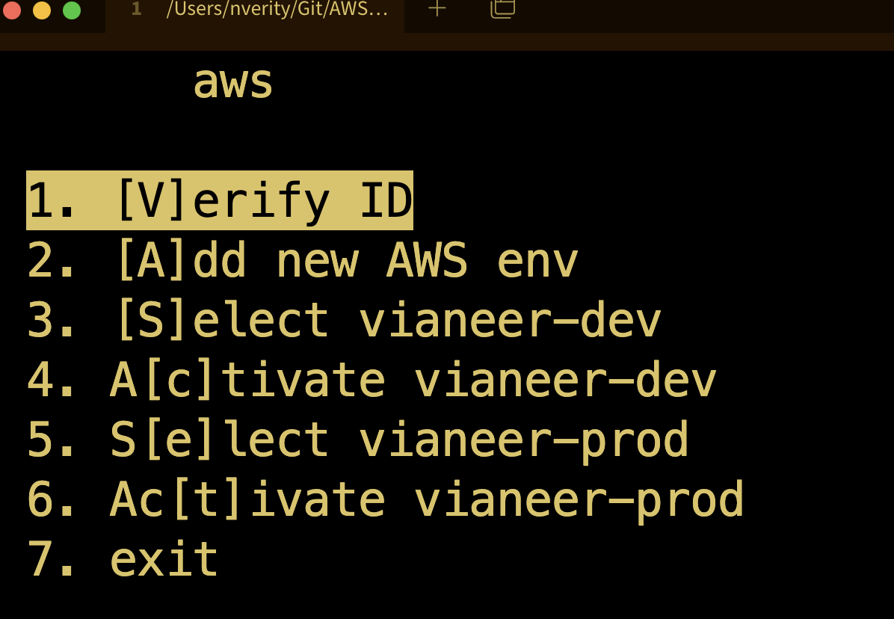

# AWS CLI default profile Manager
## Overview
Changing the default profile makes it easier to use the aws cli, especially in scripts.

This program allows profile management that will control what the default runs, in an easy and expandable way
## Setup

#### Python Libraries
On Linux and MacOS, make sure python3 is installed

On Windows, the curses library for python3 needs to be installed


#### Installing

Run `setup.sh` to do auto/guided setup


Or, modify the file `aws` to have correct path and add the line
`alias awss='/path/to/aws'`
to your `~/.bashrc`


#### CSV file

The menu is made from the csv file called `aws.csv`. 
The first field is the text to be shown on the menu. 
The second field is anything that can be run in bash.


#### General Format

There are two steps for switching AWS CLI environments, selecting the environment


**Selecting** the environment copies or add into the existitng `~/.aws` directory

The format that environments are saved are as copies of the whole `~/.aws` directory.
For example, the `/home/user/` directory would contain the folders `.aws`,`.aws_sfl`,`.aws_cbs`,`.aws_sdc`

Some of the environments are simple copy-and-replace to select, and some could be activated by running a bash script or docker image

**Activating** the environment is the step where any 2FA comes in

Some environments activate by using the aws session token, and others just need to be set to the default profile for activation


#### Adding an environment

1. Copy your `~/.aws` folder as a backup if it is not already 
1. Add the new environment to `~/.aws` and set it as the default (so you can test it works)
1. Copy the `~/.aws` folder to somewhere with a unique name (like `~/.aws_name`)
1. Add a line to the `aws.csv` file to do the selection of the environment
     - First section is the title ("Select env_name")
     - Second section is the bash command(s) used to copy that folder over the existing`~/.aws`
       - The premade `aws.csv` has this as an example
1. Done! 

See example section for more details

#### Example CSV
Here is an example `aws.csv` file to show the different parts

```csv
Verify ID, aws sts get-caller-identity; aws s3 ls
Select SFL,/home/nick/Git/DevSetup/copy_dir_to_dot_aws /home/nick/.aws_sfl
Activate SFL,echo "run the command '. /home/nick/Git/DevSetup/aws_set'"
Select CBS,/home/nick/Git/DevSetup/copy_dir_to_dot_aws /home/nick/.aws_cbs
Activate CBS,echo "Should not need activation"
Select SDC,docker run -it --rm --net=host -e TZ=America/Chicago -v ~/.aws:/root/.aws ac0a9c401fd3
Activate SDC,sed -i 's/default/olddefault/g' /home/nick/.aws/credentials; sed -i 's/sdc-mfg-dev:Developer/default/g' /home/nick/.aws/credentials;
```

And this is how it is displayed when ran


The first line
```csv
Verify ID, aws sts get-caller-identity; aws s3 ls
```
- "Verify ID" is the text displayed in the menu
- The commands `aws sts get-caller-identity` and `aws s3 ls` are ran
  - These show the user who aws sees them as and the contents of their S3 list, just to be sure
  
The lines
```csv
Select SFL,/home/nick/Git/DevSetup/copy_dir_to_dot_aws /home/nick/.aws_sfl
Activate SFL,echo "run the command '. /home/nick/Git/DevSetup/aws_set'"
```
- Shows the title "Select SFL"
  - The runs a script to copy the input directory `~/.aws_sfl` to overwrite the `~/.aws` directory
- Shows the title "Activate SFL"
  - Outputs to the user the script to activate for that environment
  - This is done because the menu cannot pass the functionality of `. ./cmd` through, which executes the `./cmd` as if it was in the current working directory

The lines
```csv
Select CBS,/home/nick/Git/DevSetup/copy_dir_to_dot_aws /home/nick/.aws_cbs
Activate CBS,echo "Should not need activation"
```
- Shows the title "Select CBS"
  - The runs a script to copy the input directory `~/.aws_sfl` to overwrite the `~/.aws` directory
- Shows the title "Activate CBS"
  - Outputs to the user tha it doesnt need activation and is good to go

The lines
```csv
Select SDC,docker run -it --rm --net=host -e TZ=America/Chicago -v ~/.aws:/root/.aws ac0a9c401fd3
Activate SDC,sed -i 's/default/olddefault/g' /home/nick/.aws/credentials; sed -i 's/sdc-mfg-dev:Developer/default/g' /home/nick/.aws/credentials;
```
- Shows the title "Select SDC"
  - The runs a docker container that modifies in place the `~.aws/credentials` file to add new profiles
- Shows the title "Activate CSDC"
  - Runs 2 `sed` commands on the `~/.aws/credentials` file
  - The first changes the default profile to be "olddefault"
  - The second changes the profile from the newly added profiles to be the default 


The included `aws.csv` has the same "Verify ID" line as well as a template line for selecting and activating


## Usage

### Adding Environments

Simply add a new entry to the `aws.csv` file to add it to the options

See the setup/csv section for more details


### Running

Run with the command chosen during setup (default `awss`)

First select the environment you want, then run the command again and activate the same environment


- Uses up and down arrows to move selection
- Enter key to select
- Number on side to select
- Key in brackets to select
  - Ex: The `a` key would select the item`[A]ctivate SFL` and the `c` key would select `A[c]tivate SFL` 


Menu system is adapted from [here](https://github.com/nickssmith/dyn-menu) for more info

Brackets and numbers are added automatically